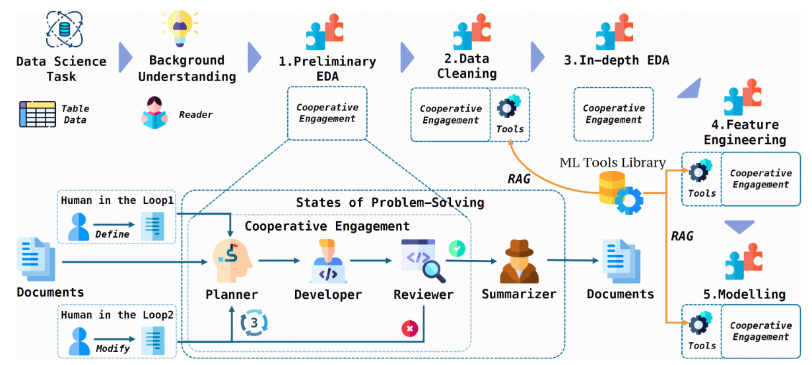

# AI_agent_research_result

- [1 AutoKaggle](#1-AutoKaggle)
  - [1-1論文簡介](#1-1論文簡介)
  - [1-2 開源測試](#1-2-開源測試)
- [2 MLE-Star](#1-MLE-Star)
  - [2-1論文簡介](#1-1論文簡介)
  - [2-2開源測試](#1-2-開源測試)

  ---

  # 1 AutoKaggle

  ## 1-1 論文簡介

1.基於Kaggle的Multi-Agent 框架
2.利用LLMs和multi-agent collaboration的階段式工作流程，並整合了incorporating iterative debugging and unit testing 。(系統性地解決了資料科學任務的複雜性)
3.開發一個Machine Learning Tools Library整合到AutoKaggle的框架中。(提升了處理複雜資料科學任務時程式碼生成的效率與品質。)
4.實作了一個comprehensive reporting system ，為每個階段的決策過程提供詳細的見解。

Library 包含資料清理、特徵工程，以及模型建立、驗證與預測。

  ## 1-2 開源測試
專案在Linux上執行，使用三常見LLM進行自身模型的開發與訓練，本身開源以Chatgpt-4o為例，測試Data以Kaggle五個資料集測試，開源[Github](https://github.com/multimodal-art-projection/AutoKaggle)，由於有使用到Ｏpenai 的API Key需要付費，因此以失敗告終

---

  # 2 MLE-Star

  ## 2-1 論文簡介

  Google 為核心開發的 machine learning engineering 系統，
  ## 2-2 開源測試
  
